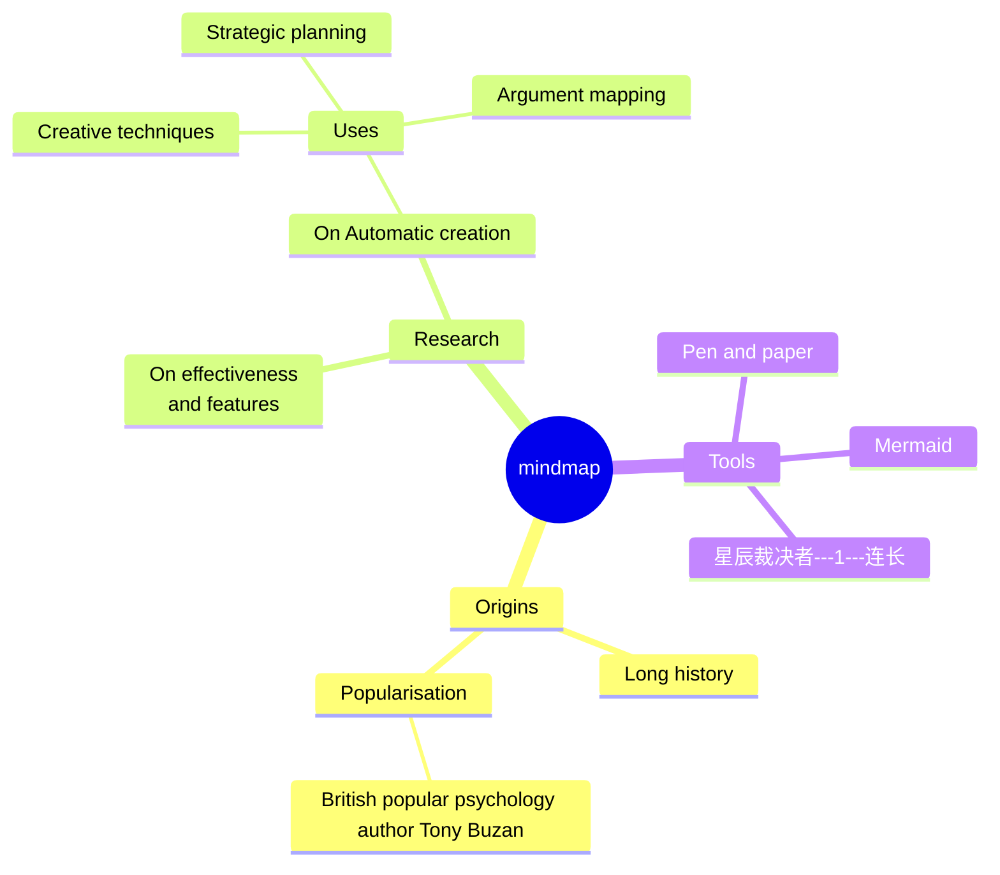

## 0.1 《北斗七星》军团官网

## 0.2 # 1 [序言]()

## 0.3 # 2 [本军团不降级条款：理想主义]()

## 0.4 # 3 [关于‘星际猎人’社群煽动网暴事件的严正声明]()

## 0.5 # 4 [组织章程]()
- ## [军团编制]()
- ## [战功的意义]()
- ## 战功的算法： [PVP]() 、 [PVE]() 、 [招人加成]()

## 0.6 # 5 [时事新闻]()
- ## [第二期--合众加成上榜人员名单出炉9.24]()

## 0.7 # 6 [课件&攻略]()
- ## [每晚20:00萌新小课堂](http://live.bilibili.com/30440983)
- ## [PVE怎么参与打城]()
- ## [PVP怎么作战]()
- ## [帝王马桶]()

## 0.8 # 7 [荣誉&活动]()
- ## [狼人杀积分赛]()
- ## [封狼居胥]()

## 0.9 # 8 [内部事务]()
- ## [查战功](https://docs.qq.com/sheet/DWmFwSEpWQ25vTmdM?tab=xmme78)
- ## [请假](https://docs.qq.com/sheet/DWmFwSEpWQ25vTmdM?tab=42ob9y)

## 0.10 # 9 [小本本]()